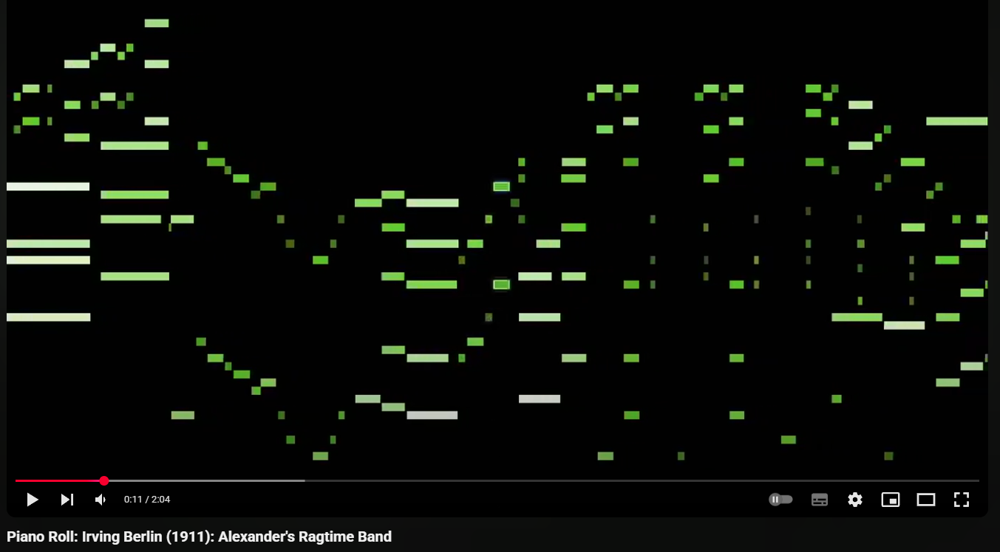

# `midi-video`

## Synopsis

See [./examples/](./examples/).

    const App = require("../src");

    const integrator = new App({
        outputpath: 'Scott_Joplin_1920_The_Entertainer.mp4',
        audiopath: 'wav/the_enterainer.wav',
        midipath: 'fixtures/29-Scott Joplin - The Entertainer (1920) Smythe.mid',
        text: {
            title: "The Entertainer",
            composer: 'Scott Joplin, 1920',
            performer: 'anonymous Piano Roll'
        }
    });

    try {
        const encoderExitStatus = await integrator.integrate();
        this.options.logger.info('Completed with code', encoderExitStatus);
    }
    catch (e) {
        console.trace();
        this.options.logger.error(e);
    }

## Constructor Options

    * `midipath`: text
    * `outputpath`: 'output.mp4',
    * `width`: 1920
    * `height`: 1080
    * `fps`: 30
    * `fitNotesToScreen`: true
    * `beatsOnScreen`: 12
    * `defaultHue`: 100 - default HSL hue value for tracks otherwise uncoloured
    * `trackHues`: if supplied, should be an object mapping the MIDI track names to HSL hue values.

## Status

### Completed so far

* Integration tests, some unit tests
* An object to render video via `ffmpeg`.
* An object to interpret  MIDI files using `midi-parser-js`.
* An object to store and render via `node-canvas`
* An object to integrate the above
* Highlight currently sounding notes
* Scale used notes to fill screen
* Quantize pitch
* Colour by track and velocity
* Process tempo changes
* Visually represent multiple voicings of the same pitch
* Adds title card
* Option to colour by note
* Option to remap MIDI pitches, for solo drum tracks

### Yet to do

* Unit tests with mocks
* remapPitches to work with noteHues
* `assertOptions` to take objects
* Check `highlightCurrent` sizes do not conflict with small note heights
* Transient annotation
* Synchronise transients to transient file
* Aftertouch, controllers (breath, expression)
* Fractional pitches

## Notes

Bitwig gives each MIDI track its own channel, with the result that a MIDI export
will contain a maximum of 16 tracks, meaning massive data loss on real-world arrangements.

## Bibliography

* http://www.kunstderfuge.com/beethoven/variae.htm#Symphonies

* https://github.com/colxi/midi-parser-js/wiki/MIDI-File-Format-Specifications
  
* http://midi.teragonaudio.com/tech/midifile/ppqn.htm

* http://www.kuhmann.com/Yamaha.htm

* https://trac.ffmpeg.org/wiki/Encode/H.264

* https://www.yourclassical.org/story/2016/08/15/daily-download-ludwig-van-beethoven--symphony-no-9-ii-molto-vivace

* https://kennethwoods.net/blog1/2011/11/22/beethoven-9-pontifications-part-ii-decoding-those-pesky-metronome-markings/

* https://magenta.tensorflow.org/datasets/groove#license
  